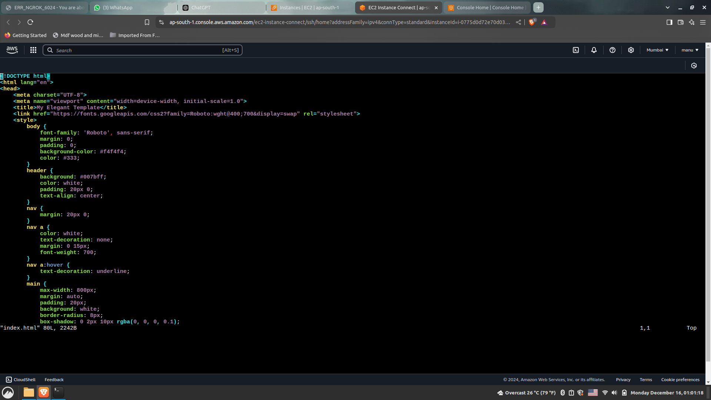

Build and deploy a simple web application on AWS EC2 using Docker.

Requirements:

* Create a Dockerfile to build a Docker image of a simple web application (e.g., a static HTML page). You can use either HTTPD / NGINX.

* Push the Docker image to an Docker HUB repository.

* Deploy the Docker image to an AWS EC2 instance using the Docker CLI.

* Configure basic security for the EC2 instance (e.g., SSH key-based authentication).

* Implement basic monitoring using Prometheus to track CPU and memory usage of the EC2 instance.

Documentation:

* Steps:

1. Create a Directory for your Project.

    ```bash
    sudo mkdir syn-project1
    sudo cd syn-project1

2. Then create a html file based on your choice.

    ```bash
    sudo vim index.html

    
    !images/Project-1-3.0.png

(3) Create a Dockerfile.

    ```bash
    sudo vim dockerfile

    images/Project-1-4.1.png

(4) Build a Docker image using the Dockerfile.

    ```bash
    sudo docker build -t my-docker-app .

    images/Project-1-5.png

(5) Run the new built Docker image and check if its Running.

    ```bash
    sudo docker run --name project-1 -p 80:80 -d manu144/p1
    sudo docker ps 

(6) Push the new built image into the Docker Hub and Check the Docker Hub to make sure.

    ```bash
    sudo docker login
    sudo docker tag p1 docker-hub-username/latest
    sudo docker push docker-hub-username/latest

(7) Create an EC2 Instance in AWS with SSH enabled.

    images/Project-1.0.0.png

(8) Login to the instance newly created and Pull the image.

    ```bash
    sudo docker pull docker-hub-username/latest

(9) After Entering into the Project Directory Create a index.html, dockerfile, Sub-Dir for Prometheus and Monitoring.

    images/Project-1-2.png

    
(10) Enter into the Prometheus Directory and configure Prometheus file.

    ```bash
    sudo cd Prometheus
    sudo vim prometheus.yml

    images/Project-1-7.png
    images/Project-1-7.2.png

(11) Enter into the monitoring Directory and create a Docker-compose file.

    ```bash
    sudo cd ..
    sudo cd monitoring
    sudo vim docker-compose.yml
    
    images/Project-1-8.png
    images/Project-1-8.1.png
    images/Project-1-8.2.png

(12) Execute the docker-compose.yml file and Check it.

    ```bash
    sudo docker-compose up -d
    sudo docker ps 
  
    images/Project-1-9.png
    images/Project-1-last.png

(13) If the compose is running use the ip address and the container port to get access into the website.
   
     ```bash 
     youripaddress:80 (html-page)
     youripaddress:9090 (Prometheus)
     youripaddress:3000 (Grafana)


     images/Project-1-10.png
     images/Project-1-10.1.png
     images/Project-1-10.2.png

(14) Configure the Prometheus and Grafana to monitor.
 
     images/Project-1 dashboard.png
 
